Path Tracer
======================

Xi Yang

Path Tracing with Participating Media
--------

See volumeintegrator.h/.cpp. 

Add medium in Camera, ray and medium interface in Intersection. 
Add medium intersection features in intersection class. 
Add homogeneous medium implementation.

Attention: If there is build error in toggled check box, please just comment that error line.
(Actually I don't know why there is a build error after I add the check box for lens camera.)

Renderings 
--------

glassballbox(default setting)

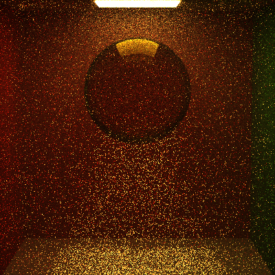

spotlight(sample 200, recursion limit 5)

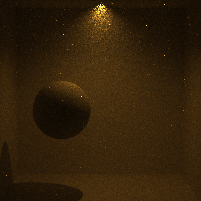

wolf(sample 200, recursion limit 5)

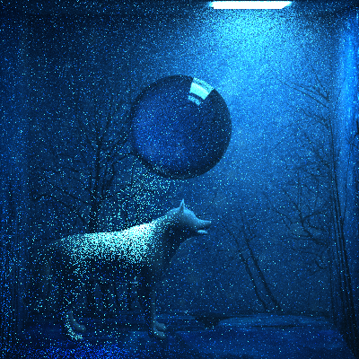

======================

Lens-based camera (REQUIRED) (10 points)
--------

Please use the check box on GUI to test Lens-based Camera!

(PT_CameraTestScene.json)

Without lens-based camera:

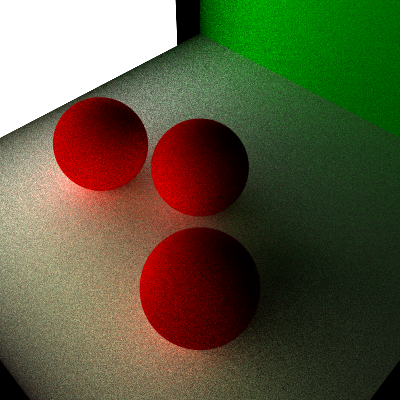

With lens-based camera:

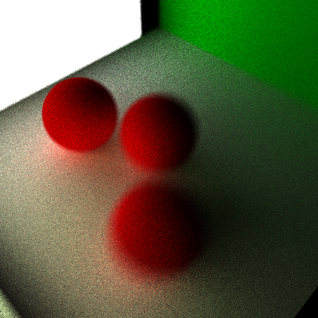

======================
----------------

* Complex implicit surfaces

+A new class Surface inherited from Shape. 

+Change of Jason file, you can specify the type of implicit surface.
 
+Now supported type: sphere(default), Ellipsoid, Torus, Heart, ToothSurface.

Renders(full lighting integrator,default settings):

torus:

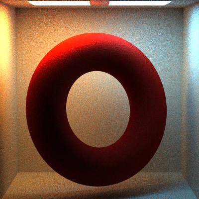

ellipsoid:

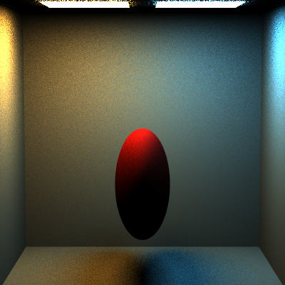

tooth surface:

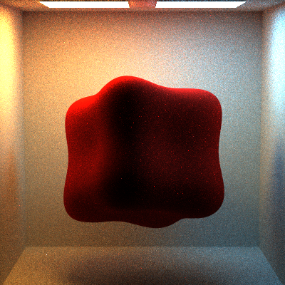

heart:

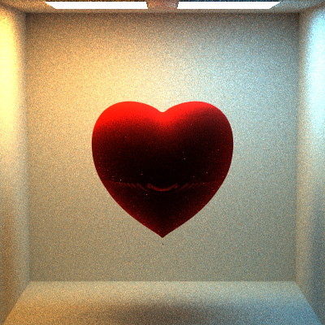

-----------
Point Light:

rendered with direct lighting integrator(default settings), the light is at the up-right corner of the box.

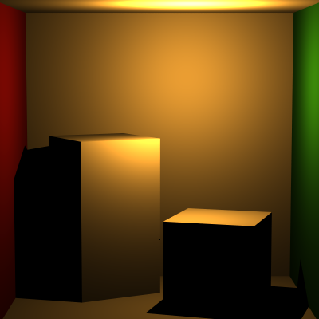

Spot Light:

rendered with direct lighting integrator(default settings), the light is at the top of the box.

Texture Projection Light:

rendered with direct lighting integrator(default settings), the light is very far top of the box.

PT_projectionLight.json

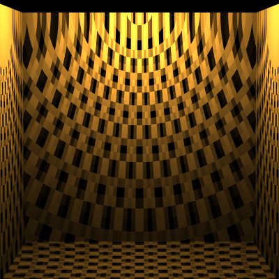

PT_cornellBox_projectionLight.json

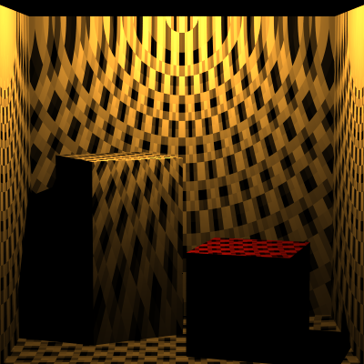

BVH Tree:
------------
wahoo(100 samples, 5 recursion limit)

Milliseconds to build BVH tree: 52

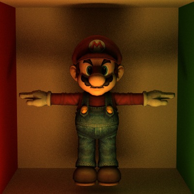

screw.jason

(400 samples, 8 recursion limit)

Milliseconds to build BVH tree: 111

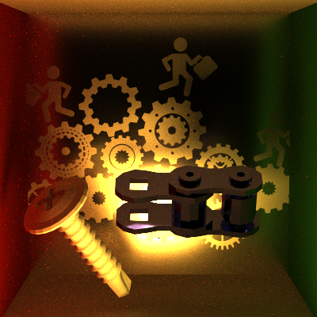

stairs.jason

(400 samples, 8 recursion limit)

Milliseconds to build BVH tree: 127

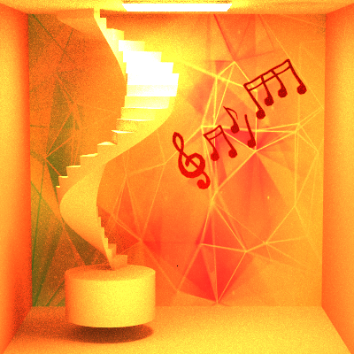

